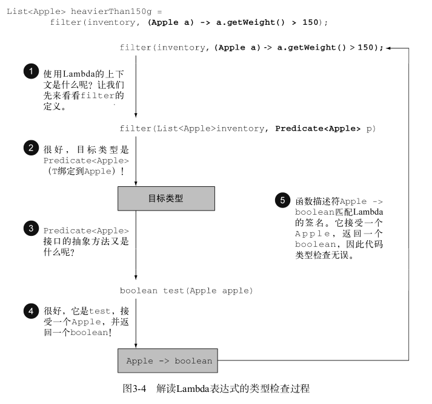

### 在哪里以及如何使用 Lambda：

- 你可以在函数式接口上使用Lambda表达式。

### 函数式接口

一言以蔽之，函数式接口就是只定义一个抽象方法的接口。

```java
public interface Predicate<T>{
	boolean test (T t);
}
```

@FunctionalInterface 又是怎么回事？
如果你去看看新的Java API，会发现函数式接口带有 @FunctionalInterface 的标注


### 环绕执行模式:

先定义一个函数式接口：这个接口定义lambda的参数和返回值。

```java
@FunctionalInterface
    public interface Predicate<T> {
        boolean test(T t);
    }
```

在方法中使用这个函数式接口：

```java
public static <T> List<T> filter(List<T> list, Predicate<T> p) {
        List<T> results = new ArrayList<>();
        for (T s: list) {
            if (p.test(s)) {
                results.add(s);
            }
        }
        return results;
    }
```

使用这个方法的时候再使用lambda定义具体的实现。

```java
Predicate<String> nonEmptyStringPredicate = (String s) -> !s.isEmpty();
List<String> nonEmpty = filter(strings, nonEmptyStringPredicate);
```

全部代码：

```java
package Java8.lambda_;

import java.util.ArrayList;
import java.util.Arrays;
import java.util.List;
import java.util.List;

public class Predicate_ {
    public static void main(String[] args) {
        Predicate<String> nonEmptyStringPredicate = (String s) -> !s.isEmpty();
        List<String> strings = new ArrayList<>();
        strings.add("aaa");
        strings.add("");
        strings.add("roczhang");
        strings.add("ssss");
        List<String> nonEmpty = filter(strings, nonEmptyStringPredicate);
        System.out.println(nonEmpty.toString());
    }

   @FunctionalInterface
    public interface Predicate<T> {
        boolean test(T t);
    }

    public static <T> List<T> filter(List<T> list, Predicate<T> p) {
        List<T> results = new ArrayList<>();
        for (T s: list) {
            if (p.test(s)) {
                results.add(s);
            }
        }
        return results;
    }
}

output：[aaa, roczhang, ssss]
```

### 类型检查、类型推断以及限制

类型检查：Lambda的类型是从使用Lambda的上下文推断出来的。上下文（比如，接受它传递的方法的
参数，或接受它的值的局部变量）中Lambda表达式需要的类型称为目标类型。



类型检查过程可以分解为如下所示。
 首先，你要找出 filter 方法的声明。
 第二，要求它是 Predicate<Apple> （目标类型）对象的第二个正式参数。
 第三， Predicate<Apple> 是一个函数式接口，定义了一个叫作 test 的抽象方法。
 第四， test 方法描述了一个函数描述符，它可以接受一个 Apple ，并返回一个 boolean 。
 最后， filter 的任何实际参数都必须匹配这个要求。
这段代码是有效的，因为我们所传递的Lambda表达式也同样接受 Apple 为参数，并返回一个
boolean 。