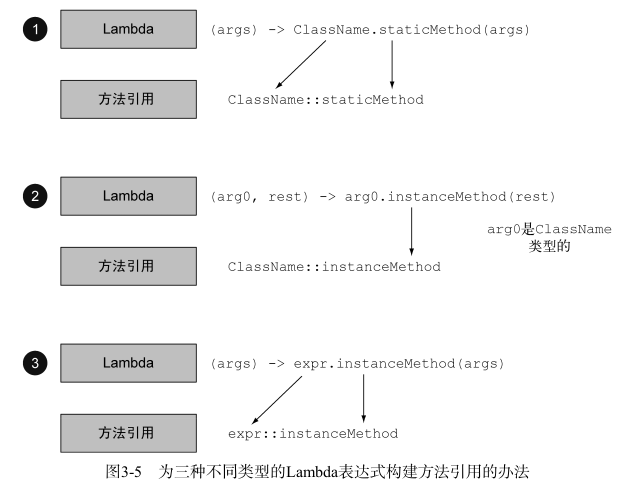

### 在哪里以及如何使用 Lambda：

- 你可以在函数式接口上使用Lambda表达式。

## 函数式接口

一言以蔽之，函数式接口就是只定义一个抽象方法的接口。

```java
public interface Predicate<T>{
	boolean test (T t);
}
```

@FunctionalInterface 又是怎么回事？
如果你去看看新的Java API，会发现函数式接口带有 @FunctionalInterface 的标注


### 环绕执行模式:

先定义一个函数式接口：这个接口定义lambda的参数和返回值。

```java
@FunctionalInterface
    public interface Predicate<T> {
        boolean test(T t);
    }
```

在方法中使用这个函数式接口：

```java
public static <T> List<T> filter(List<T> list, Predicate<T> p) {
        List<T> results = new ArrayList<>();
        for (T s: list) {
            if (p.test(s)) {
                results.add(s);
            }
        }
        return results;
    }
```

使用这个方法的时候再使用lambda定义具体的实现。

```java
Predicate<String> nonEmptyStringPredicate = (String s) -> !s.isEmpty();
List<String> nonEmpty = filter(strings, nonEmptyStringPredicate);
```

全部代码：

```java
package Java8.lambda_;

import java.util.ArrayList;
import java.util.Arrays;
import java.util.List;
import java.util.List;

public class Predicate_ {
    public static void main(String[] args) {
        Predicate<String> nonEmptyStringPredicate = (String s) -> !s.isEmpty();
        List<String> strings = new ArrayList<>();
        strings.add("aaa");
        strings.add("");
        strings.add("roczhang");
        strings.add("ssss");
        List<String> nonEmpty = filter(strings, nonEmptyStringPredicate);
        System.out.println(nonEmpty.toString());
    }

   @FunctionalInterface
    public interface Predicate<T> {
        boolean test(T t);
    }

    public static <T> List<T> filter(List<T> list, Predicate<T> p) {
        List<T> results = new ArrayList<>();
        for (T s: list) {
            if (p.test(s)) {
                results.add(s);
            }
        }
        return results;
    }
}

output：[aaa, roczhang, ssss]
```

## 类型检查、类型推断以及限制

类型检查：Lambda的类型是从使用Lambda的上下文推断出来的。上下文（比如，接受它传递的方法的
参数，或接受它的值的局部变量）中Lambda表达式需要的类型称为目标类型。


类型检查过程可以分解为如下所示。
 首先，你要找出 filter 方法的声明。
 第二，要求它是 Predicate<Apple> （目标类型）对象的第二个正式参数。
 第三， Predicate<Apple> 是一个函数式接口，定义了一个叫作 test 的抽象方法。
 第四， test 方法描述了一个函数描述符，它可以接受一个 Apple ，并返回一个 boolean 。
 最后， filter 的任何实际参数都必须匹配这个要求。
**这段代码是有效的，因为我们所传递的Lambda表达式也同样接受 Apple 为参数，并返回一个**
**boolean 。**

### 同样的lambda，不同的函数式接口

有了目标类型的概念，同一个Lambda表达式就可以与不同的函数式接口联系起来，只要它们的抽象方法签名能够兼容。

### 类型推断

就是使用lambda的时候不懈类型，直接使用变量名即可。

```java
Comparator<Apple> c =(Apple a1, Apple a2)->a1.getWeight().compareTo(a2.getWeight());
```

有类型推断

```java
Comparator<Apple> c =
(a1, a2) -> a1.getWeight().compareTo(a2.getWeight());
```

### 使用局部变量

Lambda表达式
也允许使用自由变量

```java
int portNumber = 1337;
Runnable r = () -> System.out.println(portNumber);
```

尽管如此，还有一点点小麻烦：关于能对这些变量做什么有一些限制。Lambda可以没有限
制地捕获（也就是在其主体中引用）实例变量和静态变量。但局部变量必须显式声明为 final ，
或事实上是 final 。

### 对局部变量的限制

你可能会问自己，为什么局部变量有这些限制。第一，实例变量和局部变量背后的实现有一
个关键不同。实例变量都存储在堆中，而局部变量则保存在栈上。如果Lambda可以直接访问局
部变量，而且Lambda是在一个线程中使用的，则使用Lambda的线程，可能会在分配该变量的线
程将这个变量收回之后，去访问该变量。因此，Java在访问自由局部变量时，实际上是在访问它
的副本，而不是访问原始变量。如果局部变量仅仅赋值一次那就没有什么区别了——因此就有了
这个限制。

## 方法引用

你可以把方法引用看作针对仅仅涉及单一方法的Lambda的语法糖，因为你表达同样的事情
时要写的代码更少了。

目 标 引 用 放 在 分 隔 符 :: 前 ， 方 法 的 名 称 放 在 后 面 。

Apple::getWeight 就是引用了 Apple 类中定义的方法 getWeight 。

方法引用就是Lambda表达式 (Apple a) -> a.getWeight() 的快捷写法。

| (Apple a) -> a.getWeight()               | Apple::getWeight                  |
| ---------------------------------------- | --------------------------------- |
| () -> Thread.currentThread().dumpStack() | Thread.currentThread()::dumpStack |
| (str, i) -> str.substring(i)             | String::substring                 |
| (String s) -> System.out.println(s)      | System.out::println               |


### 如何构建方法引用

- 指向静态方法的方法引用（例如 Integer 的 parseInt 方法，写作 Integer::parseInt ）。
- 指 向 任 意 类 型 实 例 方 法 的 方 法 引 用 （ 例 如 String 的 length 方 法 ， 写 作
  
  String::length ）
- 指向现有对象的实例方法的方法引用（假设你有一个局部变量 expensiveTransaction
  用于存放 Transaction 类型的对象，它支持实例方法 getValue ，那么你就可以写 expensive-Transaction::getValue ）。



例子：

```java
List<String> str = Arrays.asList("a","b","A","B");
str.sort((s1, s2) -> s1.compareToIgnoreCase(s2));
```

改为下面的样子

```java
List<String> str = Arrays.asList("a","b","A","B");
str.sort(String::compareToIgnoreCase);
```

习题：下列Lambda表达式的等效方法引用是什么？

1.

```java
Function<String, Integer> stringToInteger = (String s) -> Integer.parseInt(s);
```

这个Lambda表达式将其参数传给了 Integer 的静态方法 parseInt 。这种方法接受一个需要解析的 String ，并返回一个 Integer 。

```java
Function<String, Integer> stringToInteger = Integer::parseInt;
```


2.

```java
BiPredicate<List<String>, String> contains =(list, element) -> list.contains(element);
```

这个Lambda使用其第一个参数，调用其 contains 方法

```java
BiPredicate<List<String>, String> contains = List::contains;
```

这是因为，目标类型描述的函数描述符是 (List<String>,String) -> boolean ，而List::contains 可以被解包成这个函数描述符。

### 构造函数引用

对 于 一 个 现 有 构 造 函 数 ， 你 可 以 利 用 它 的 名 称 和 关 键 字 new 来 创 建 它 的 一 个 引 用 ：
ClassName::new 。它的功能与指向静态方法的引用类似。例如，假设有一个构造函数没有参数。
它适合 Supplier 的签名 () -> Apple 。你可以这样做：

无参构造：

```java
Supplier<Apple> c1 = Apple::new;
Apple a1 = c1.get();
```

等价于

```java
Supplier<Apple> c1 = () -> new Apple();
Apple a1 = c1.get();
```

有参构造：如果你的构造函数的签名是 Apple(Integer weight) ，那么它就适合 Function 接口的签
名，于是你可以这样写：

```java
Function<Integer, Apple> c2 = Apple::new;
Apple a2 = c2.apply(110);
```

等价于：

```java
Function<Integer, Apple> c2 = (weight) -> new Apple(weight);
Apple a2 = c2.apply(110);
```


