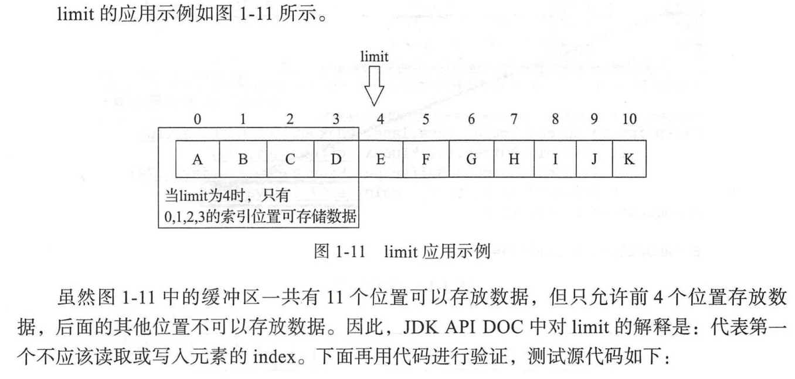
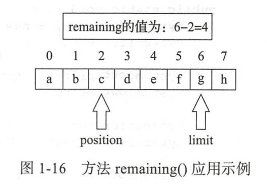
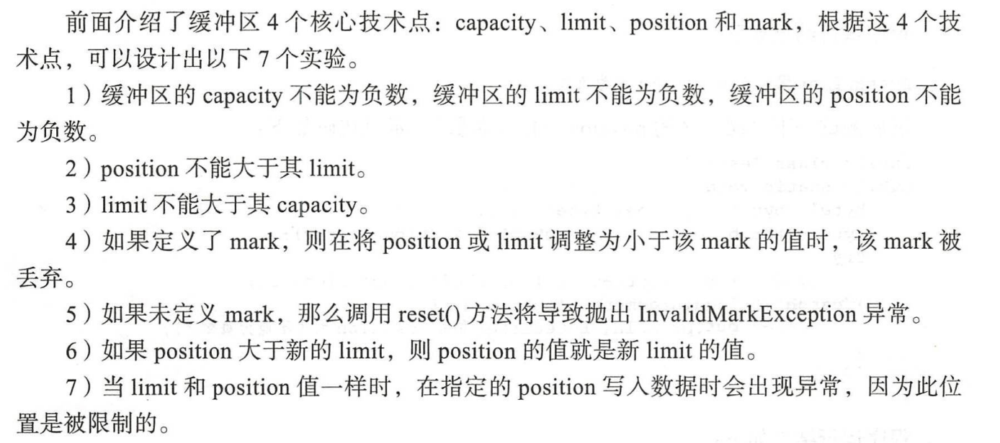
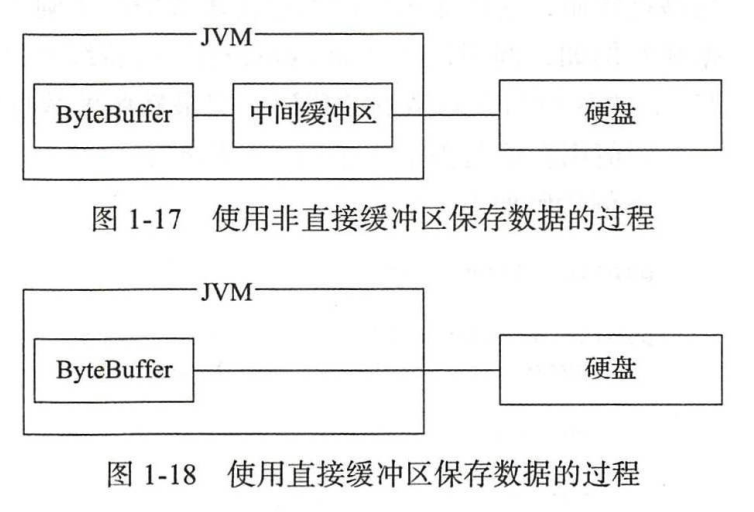

## 缓冲区的介绍：

使用传统IO流时，一般使用byte[]字节数组来缓存字节流。Java中对array数组自身进行操作的API比较少，可以使用NIO技术中的缓冲区Buffer类来解决。

## Buffer类的使用

Buffer类时抽象类，不能直接new来实例化，使用数组包装（wrap）进缓冲区。需要借助静态方法wrap（）进行实现。

### 四个核心技术点：

- capacity（容量）：索引为8。cap为9。
- limit（限制）limit的位置不可读。（也可理解成只有前limit数据可读。索引从0开始）
- position（位置）索引从0开始。指向的索引为开始位置。
- mark（标记）

大小关系如下：

0 <= mark <= position <= limit <= capacity

#### 容量

就是缓冲区的大小，比如创建一个缓冲区，数组大小为3，那么capacity的值就为3.

capacity的值不能为负，且不能更改。

```java
        byte[] byteArrays = {1, 2, 3};

        ByteBuffer byteBuffer = ByteBuffer.wrap(byteArrays);
```

#### 限制

作用时设置此缓冲区限制，代表第一个不应该**读取或写入**元素的索引，limit不能为负，不能大于capacity。(0-cap)

注意⚠️：

- position大于limit是不行的，如果position设置的大于了limit，这limit会变成position的值。
- 如果mark已经定义了且大于新的limit，则丢弃该mark。



这里用一个代码作为例子

```java
public static void main(String[] args) {
    char[] charArray= {'a', 'b', 'c', 'd', 'e'};
    CharBuffer charBuffer = CharBuffer.wrap(charArray);
    System.out.println("A capacity() =" + charBuffer.capacity() + " limit()=" + charBuffer.limit());
    charBuffer.limit(3);
    System.out.println();

    System.out.println("A capacity() =" + charBuffer.capacity() + " limit()=" + charBuffer.limit());

    charBuffer.put(0, 'o');
    charBuffer.put(1, 'p');
    charBuffer.put(2, 'q');
    // 这里会报错，因为设置了limit为3，索引为3的位置已经不能读写了。
  	charBuffer.put(3, 'r');
    charBuffer.put(4, 's');
    charBuffer.put(5, 't');
    charBuffer.put(6, 'u');

}
```

#### 位置 position

作用：设置此缓冲区新的位置。位置代表“下一个”要读取或写入的元素的索引，值不能为负。position不能大于其limit。

如下code，设置位置之后插入元素，新插入的元素在position位置上。注意⚠️：position的索引从0开始。

```java
public static void main(String[] args) {
    char[] charArray = {'a', 'b', 'c', 'd'};
    CharBuffer charBuffer = CharBuffer.wrap(charArray);
    System.out.println("A capacity()=" + charBuffer.capacity() +
            " limit()=" + charBuffer.limit() +
            " position()=" + charBuffer.position());
    charBuffer.position(2);
    System.out.println("===============================");
    System.out.println("A capacity()=" + charBuffer.capacity() +
            " limit()=" + charBuffer.limit() +
            " position()=" + charBuffer.position());
    charBuffer.put("z");
    for (int i = 0; i < charArray.length; i++) {
        System.out.print(charArray[i] + " ");
    }
}
```

#### 剩余空间大小的获取

remaining（）的作用：返回“当前位置”与limit之间的元素数。limit-position



#### mark（）方法处理标记

在此缓冲区的位置设置标记。缓冲区的标记是一个索引，在调用reset()方法时，会将缓冲区的position位置重置为该索引。

注意⚠️：mark不能大于position。调整position和limit的位置时，如果小于了mark，这该mark失效。丢弃后的mark值为-1.

### 知识点：



### 判断只读

告知此缓冲区是否为只读缓冲区。

### 直接缓冲区

isDirect()方法的作用：判断此缓冲区是否为直接缓冲区。

通过ByteBuffer向硬盘存取数据时是需要将数据暂存在JVM的中间缓冲区。使用直接缓冲可以调高程序的运行效率。



### 还原缓冲区的状态

作用：还原缓冲区到初始的状态：将位置设置为0，将限制设置为容量，并丢弃标记。

注意⚠️：这个方法并不能清楚数据，只是重新写入缓冲区的数据会把原数据覆盖。

```java
    public static void main(String[] args) {
        byte[] byteArray = {1, 2, 3};
        ByteBuffer byteBuffer = ByteBuffer.wrap(byteArray);

        byteBuffer.position(2);
        byteBuffer.limit(3);
        byteBuffer.mark();

        System.out.println(byteBuffer.capacity());
        System.out.println("pos=" + byteBuffer.position() + " limit=" + byteBuffer.limit());

        byteBuffer.clear();
        System.out.println("pos=" + byteBuffer.position() + " limit=" + byteBuffer.limit());
    }
=============================
3
pos=2 limit=3
pos=0 limit=3
```

#### 对缓冲区进行反转

flip作用：反转此缓冲区，首先将限制设置为当前位置，然后将位置设置为0，如果定义了标记，则丢弃。

向缓冲区存数据5个，现在想取出来，调用flip即可。他会将limit设置为5，将位置设置为0。就可以读取五个数据了。

注意⚠️：由于position索引从0开始。存入五个数据后，索引在第六个位置上，也就是5。此时将limit设置为5.就可以读取前五个数据。

```java
charBuffer.put("我是美国人");
System.out.println("A position=" + charBuffer.position() + " limit=" + charBuffer.limit());

//        charBuffer.limit(charBuffer.position());
//        charBuffer.position(0);
//        System.out.println("A position=" + charBuffer.position() + " limit=" + charBuffer.limit());
// 将上面的语句使用flip替代
charBuffer.flip();

for (int i = 0; i < charBuffer.limit(); i++) {
System.out.print(charBuffer.get());
}
```

### 判断当前位置与限制之间是否还有剩余元素

hasRemaining作用：判断当前位置和限制之间是否还有元素.

注意⚠️：这里的position是2，也就是索引为1.限制为3也就是索引为2.

```java
public static void main(String[] args) {
    byte[] byteArray = {1, 2, 3};
    ByteBuffer byteBuffer = ByteBuffer.wrap(byteArray);
    byteBuffer.limit(3);
    byteBuffer.position(2);

    System.out.println("has = " + byteBuffer.hasRemaining() + " byteBuffer.remaining=" + byteBuffer.remaining());
}
```

### 重绕缓冲区

rewind() 方法：重绕此缓冲区，**将位置设置为0**，并丢弃标记。在一系列通道“重新写入或获取”的操作之前调用此方法。

```java
public static void main(String[] args) {
    byte[] byteArray = {1, 2, 3, 4, 5};
    ByteBuffer byteBuffer = ByteBuffer.wrap(byteArray);

    System.out.println("cap=" + byteBuffer.capacity() + " limit=" + byteBuffer.limit() + " pos=" + byteBuffer.position());
    byteBuffer.position(1);
    byteBuffer.limit(3);
    byteBuffer.mark();
    System.out.println("cap=" + byteBuffer.capacity() + " limit=" + byteBuffer.limit() + " pos=" + byteBuffer.position());

    byteBuffer.rewind();
    System.out.println("cap=" + byteBuffer.capacity() + " limit=" + byteBuffer.limit() + " pos=" + byteBuffer.position());
    byteBuffer.reset();
}
```

### 获取偏移量

arrayOffset：返回次缓冲区的底层实现数组中第一个缓冲区元素的偏移量。

### 使用List.toArray转成数组类型

将List中存储的ByteBuffer转换成ByteBuffer[]数组类型

```java
    public static void main(String[] args) {
        ByteBuffer buffer1 = ByteBuffer.wrap(new byte[]{'a', 'b', 'c'});
        ByteBuffer buffer2 = ByteBuffer.wrap(new byte[]{'x', 'y', 'z'});
        ByteBuffer buffer3 = ByteBuffer.wrap(new byte[]{'1', '2', '3'});
        List<ByteBuffer> list = new ArrayList<>();

        list.add(buffer1);
        list.add(buffer2);
        list.add(buffer3);

        ByteBuffer[] byteBufferArray = new ByteBuffer[list.size()];

        // 主要是这一个操作
        list.toArray(byteBufferArray);

        for (int i = 0; i < byteBufferArray.length; i++) {
            ByteBuffer eachByteBuffer = byteBufferArray[i];
            while (eachByteBuffer.hasRemaining()) {
                System.out.println((char) eachByteBuffer.get());
            }
            System.out.println();
        }
    }
```

### ByteBuffer的使用

提供了六类操作：

- 以绝对位置和相对位置读写单个字节的get和put方法。
- 使用相对批量get方法可以将缓冲区中的连续字节传输到byte[] dst目标数组中。
- 使用相对批量put方法可以将byte数组或其他字节缓冲区中的连续字节存储到此缓冲区中。
- 等等。。。

### 创建堆缓冲区和直接缓冲区

使用直接缓冲区， JVM会尽量在直接字节缓冲区上执行本机IO操作。直接对内核空间进行访问。

```
    public static void main(String[] args) {
        ByteBuffer byteBuffer1 = ByteBuffer.allocateDirect(100);
        ByteBuffer byteBuffer2 = ByteBuffer.allocate(100);
    }
```

### put与get方法的使用

调用get和put方法都会似的pos递增。

```java
public static void main(String[] args) {
    ByteBuffer byteBuffer = ByteBuffer.allocate(10);
    System.out.println("cap=" + byteBuffer.capacity() + "limit=" + byteBuffer.limit() + "pos=" + byteBuffer.position());
    byteBuffer.put((byte) 125);
    System.out.println("cap=" + byteBuffer.capacity() + "limit=" + byteBuffer.limit() + "pos=" + byteBuffer.position());
    byteBuffer.put((byte) 126);
    System.out.println("cap=" + byteBuffer.capacity() + "limit=" + byteBuffer.limit() + "pos=" + byteBuffer.position());
    byteBuffer.put((byte) 127);
    System.out.println("cap=" + byteBuffer.capacity() + "limit=" + byteBuffer.limit() + "pos=" + byteBuffer.position());
    byteBuffer.rewind();
    System.out.println("cap=" + byteBuffer.capacity() + "limit=" + byteBuffer.limit() + "pos=" + byteBuffer.position());
    System.out.println(byteBuffer.get());
    System.out.println("cap=" + byteBuffer.capacity() + "limit=" + byteBuffer.limit() + "pos=" + byteBuffer.position());
    System.out.println(byteBuffer.get());
    System.out.println("cap=" + byteBuffer.capacity() + "limit=" + byteBuffer.limit() + "pos=" + byteBuffer.position());
    System.out.println(byteBuffer.get());
    System.out.println("cap=" + byteBuffer.capacity() + "limit=" + byteBuffer.limit() + "pos=" + byteBuffer.position());
    System.out.println(byteBuffer.get());
    System.out.println("--------------------------------------------");
    byte[] getByteArray = byteBuffer.array();
    System.out.println("getByteArray.length = " + getByteArray.length);
    for (int i = 0; i < getByteArray.length; i++) {
        System.out.print(getByteArray[i] + " - ");
    }
}
```

put与get的时候设置偏移量

注意⚠️：

- offset+length的值必须小于src.length
- 参数的length的值必须小于buffer.remaining

```java
public static void main(String[] args) {
    byte[] byteArrayIn1 = {1, 2, 3, 4, 5, 6, 7, 8};
    byte[] byteArrayIn2 = {55, 66, 77, 88};

    ByteBuffer byteBuffer = ByteBuffer.allocate(10);

    byteBuffer.put(byteArrayIn1);

    byteBuffer.position(2);
    // 这里的偏移量是byteArrayIn2的偏移量,偏移一个，就是从第二个索引开始
    byteBuffer.put(byteArrayIn2, 1, 3);
    System.out.print("A=");
    byte[] getByte = byteBuffer.array();
    for (int i = 0; i < getByte.length; i++) {
        System.out.print(getByte[i] + " ");
    }
    System.out.println();

    byteBuffer.position(1);
    // 创建数组存储缓冲区的数据
    byte[] byteArrayOut = new byte[byteBuffer.capacity()];
    // byteArrayOut 偏移3个，从第四个索引开始。
    byteBuffer.get(byteArrayOut, 3, 4);
    System.out.print("B=");
    for (int i = 0; i < byteArrayOut.length; i++) {
        System.out.print(byteArrayOut[i] + " ");
    }
}
```

将缓冲区的数据写入到输出数组中，这里有个判断，首先判断缓冲数组里面还有没有数据。如果有数据，就往out数组里面写出。有多少写多少。

```java
public static void main(String[] args) {
    // 将缓冲区的数据写入到输出数组中
    byte[] byteArrayIn = {1, 2, 3, 4, 5, 6, 7, 8, 9, 10, 11, 12};
    ByteBuffer byteBuffer = ByteBuffer.wrap(byteArrayIn);
    byte[] byteArrayOut = new byte[5];
    while (byteBuffer.hasRemaining()) {
        int readLength = Math.min(byteBuffer.remaining(), byteArrayOut.length);
        byteBuffer.get(byteArrayOut, 0, readLength);
        for (int i = 0; i < readLength; i++) {
            System.out.print(byteArrayOut[i] + " ");
        }
        System.out.println();
    }
}
```

put时，缓冲数组长度下雨输入数组长度。

```java
public static void main(String[] args) {
    // 将一个数组的数据写入到缓存中
    byte[] byteArray1 = {1, 2, 3, 4, 5, 6, 7, 8, 9, 10};
    ByteBuffer byteBuffer1 = ByteBuffer.allocate(4);
    int byteArrayCurrentIndex = 0;
    int byteArrayRemaining = 0;
    // byteArrayCurrentIndex记录byteArray1写入到了哪，由于byteArray1是分段写入的，所以需要记录。
    // 当byteArray1 == byteArrayCurrentIndex时， 说明这个数组已经写入完了。 
    while (byteArrayCurrentIndex < byteArray1.length) {
        // 计算byteArray1还剩多少数据。
        byteArrayRemaining = byteArray1.length - byteArrayCurrentIndex;
        // 如果byteArray1剩余的数据比较多，就将读取数据的长度设置为缓冲区的长度。因为缓冲区只有这么长，一次只能读取它长度的数据
        int readLength = Math.min(byteArrayRemaining, byteBuffer1.remaining());
        // 将byteArray1的要读取的索引区间的数据取出来。
        byte[] newByteArray = Arrays.copyOfRange(byteArray1, byteArrayCurrentIndex, byteArrayCurrentIndex + readLength);
        // 将取出来的数据写入缓冲区
        byteBuffer1.put(newByteArray);
        byteBuffer1.flip();  // 读取数据时用到flip，他会将limit设置到最后一个存入的数据索引上。
        byte[] getByte = byteBuffer1.array();
        for (int i = 0; i < byteBuffer1.limit(); i++) {
            System.out.println(getByte[i] + " ");
        }
        System.out.println();
        byteArrayCurrentIndex = byteArrayCurrentIndex + readLength;
        byteBuffer1.clear();  // 将缓冲区的位置和限制设置到初始位置，方便下一次读取。

    }
}
```

1.4.7后面的实验先不做。

1.5的charBuffer估计和ByteBuffer差不多。所以这里先不看，不然Channel的章节实验做不完。