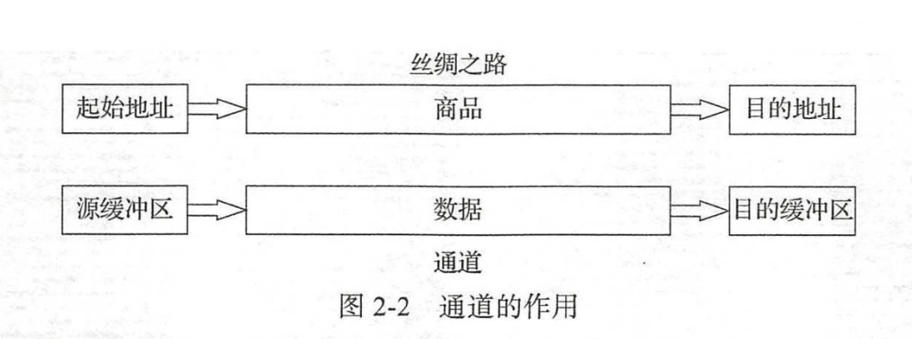

NIO技术中的数据要放在缓冲区进行管理，再使用通道将缓冲区中的数据传输到目的地



## FileChannel类的使用

作用：读取、写入、映射和**操作文件**的通道。该通道永远是阻塞的。内部维护当前文件的position。可对其进行查询和修改。该文件本身包含一个可读写、长度可变的字节序列。可以增大减小、关联元数据。

- 以不影响通道当前位置的方式，对文件中绝对位置的字节进行读取和写入。

- 将文件中的某个区域直接映射到内存中。对于较大的文件，这通常比调用普通的read和write方法更为高效。

- 强制对底层存储设备进行文件的更新，确保在系统崩溃时不丢失数据。

- 以一种可被很多操作系统优化为直接向文件系统缓存发送或从中读取的高速传输方法。将字节从文件传输到某个通道中。反之亦然。

- 可以锁定没有文件区域，以阻止其他程序对其进行访问。

  

### 写操作与位置的使用

直接写入的是pos-limit之间的数据.一个可写入通道上只能进行一个写入操作。

1. 将buffer缓冲区的remaining字节序列写入通道的当前位置
2. write方法是同步的。

```java
    public static void main(String[] args) throws IOException {
        // 将buffer的数据写入到文件。
        FileOutputStream fosRef = new FileOutputStream(new File("/Volumes/roczhang/temp/a.txt"));
        FileChannel fileChannel = fosRef.getChannel();
        try {
            ByteBuffer buffer = ByteBuffer.wrap("abcde".getBytes());
            System.out.println("fileChannel.pos=" + fileChannel.position());
            // 返回值好像是写入字节数。
            System.out.println("write 1 返回值" + fileChannel.write(buffer));
            System.out.println("fileChannel.pso=" + fileChannel.position());
            fileChannel.position(2);
            buffer.rewind(); // 还原buffer的position为0
            System.out.println("write 2 返回值" + fileChannel.write(buffer));
            System.out.println("fileChannel.pos=" + fileChannel.position());
        } catch (IOException e) {
            e.printStackTrace();
        }
        fileChannel.close();
        fosRef.close();
    }
==================================
fileChannel.pos=0
write 1 返回值5
fileChannel.pso=5
write 2 返回值5
fileChannel.pos=7
```


```java
public static void main(String[] args) throws IOException {
  // 将buffer的数据写入到文件。
  FileOutputStream fosRef = new FileOutputStream(new File("/Volumes/roczhang/temp/a.txt"));
  FileChannel fileChannel = fosRef.getChannel();
  try {
    ByteBuffer buffer1 = ByteBuffer.wrap("abcde".getBytes());
    ByteBuffer buffer2 = ByteBuffer.wrap("12345".getBytes());
    fileChannel.write(buffer1);
    // 限制读取
    buffer2.position(1);
    buffer2.limit(3);
    fileChannel.position(2);
    // 直接写入的是pos-limit之间的数据
    fileChannel.write(buffer2);
  } catch (IOException e) {
    e.printStackTrace();
  }
  fileChannel.close();
  fosRef.close();
}
    
ab23e
```

同时write方法是同步的

```java
public class demo2_write_tb {
    private static FileOutputStream fosRef;
    private static FileChannel fileChannel;
    public static void main(String[] args) throws IOException, InterruptedException {
        // 将buffer的数据写入到文件。
        fosRef = new FileOutputStream(new File("/Volumes/roczhang/temp/a.txt"));
        fileChannel = fosRef.getChannel();

        for (int i = 0; i < 10; i++) {
            Thread thread1 = new Thread() {
                @Override
                public void run() {
                    try {
                        ByteBuffer buffer = ByteBuffer.wrap("abcde\r\n".getBytes());
                        fileChannel.write(buffer);
                    } catch (IOException e) {
                        e.printStackTrace();
                    }
                }
            };

            Thread thread2 = new Thread() {
                @Override
                public void run() {
                    try {
                        ByteBuffer buffer = ByteBuffer.wrap("我是中国人\r\n".getBytes());
                        fileChannel.write(buffer);
                    } catch (IOException e) {
                        e.printStackTrace();
                    }
                }
            };
            thread1.start();
            thread2.start();
        }
        Thread.sleep(3000);
        fileChannel.close();
        fosRef.close();
    }
}
==========================
abcde
我是中国人
abcde
abcde
我是中国人
我是中国人
abcde
我是中国人
abcde
我是中国人
abcde
我是中国人
abcde
我是中国人
abcde
我是中国人
我是中国人
abcde
abcde
我是中国人
```

### 读操作

将字节序列从此通道的当前位置读入给定的缓冲区的当前位置。一个通道只能进行一个读取操作。read方法返回值代表读取的字节数，读到末尾返回-1。

1. 将字节序列读入buffer缓冲区的remaining空间中
2. 同步

