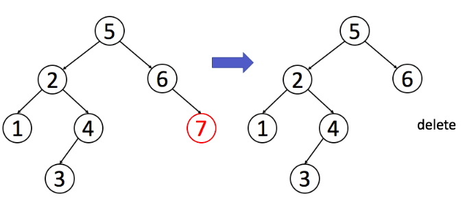
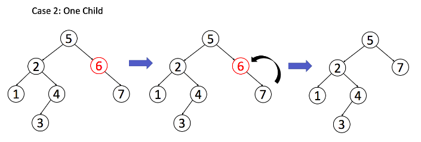
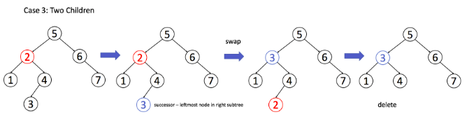

# 二叉树

## 第一期

二叉树的遍历：只要涉及递归，都可以抽象成二叉树的问题

- 前序遍历：根结点 ---> 左子树 ---> 右子树
- 中序遍历：左子树---> 根结点 ---> 右子树
- 后序遍历：左子树 ---> 右子树 ---> 根结点
- 层次遍历：只需按层次遍历即可

```java
void traverse(TreeNode root) {
    // 前序遍历
    traverse(root.left);
    // 中序遍历
    traverse(root.right);
    // 后序遍历
}
```

**写树相关的算法，简单说就是，先搞清楚当前** **`root`** **节点「该做什么」以及「什么时候做」，然后根据函数定义递归调用子节点**

翻转二叉树：root需要把左右两个子结点交换。前序和后序遍历都可以实现。

```java
TreeNode invertTree(TreeNode root) {
    // 当遍历到最后节点的时候，没有左右子结点，直接返回即可。
    if (root == null) {
        return null;
    }
    // 前序遍历，root->left->right
    // root 节点交换左右子节点
    TreeNode tmp = root.left;
    root.left = root.right;
    root.right = tmp;
    
    // 让左右子树继续遍历
    invertTree(root.left);
    invertTree(root.right);
   	return root;
}
```

填充二叉树节点的右侧指针：每一层的节点都连接起来，root需要做的事情root1.next = root2

```java
// 主函数
Node connect(Node root) {
    if (root == null) return null;
    connectTwoNode(root.left, root.right);
    return root;
}

// 辅助函数
void connectTwoNode(Node node1, Node node2) {
    if (node1 == null || node2 == null) {
        return;
    }
    /**** 前序遍历位置 ****/
    // 将传入的两个节点连接
    node1.next = node2;

    // 连接相同父节点的两个子节点
    connectTwoNode(node1.left, node1.right);
    connectTwoNode(node2.left, node2.right);
    // 连接跨越父节点的两个子节点
    connectTwoNode(node1.right, node2.left);
}
```

将二叉树展开为链表：这题不是很懂

```java
// 定义：将以 root 为根的树拉平为链表
void flatten(TreeNode root) {
    // base case
    if (root == null) return;

    flatten(root.left);
    flatten(root.right);

    /**** 后序遍历位置 ****/
    // 1、左右子树已经被拉平成一条链表
    TreeNode left = root.left;
    TreeNode right = root.right;

    // 2、将左子树作为右子树
    root.left = null;
    root.right = left;

    // 3、将原先的右子树接到当前右子树的末端
    TreeNode p = root;
    while (p.right != null) {
        p = p.right;
    }
    p.right = right;
}
```

## 第二期

构造最大二叉树：根节点的任务是找出最大值即可。然后继续构造左右节点。

```java
TreeNode constructMaximumBinaryTree([3,2,1,6,0,5]) {
    // 找到数组中的最大值
    TreeNode root = new TreeNode(6);
    // 递归调用构造左右子树
    root.left = constructMaximumBinaryTree([3,2,1]);
    root.right = constructMaximumBinaryTree([0,5]);
    return root;
}
```

具体代码：

```java
/* 主函数 */
TreeNode constructMaximumBinaryTree(int[] nums) {
    return build(nums, 0, nums.length - 1);
}

/* 将 nums[lo..hi] 构造成符合条件的树，返回根节点 */
TreeNode build(int[] nums, int lo, int hi) {
    // base case
    if (lo > hi) {
        return null;
    }

    // 找到数组中的最大值和对应的索引
    int index = -1, maxVal = Integer.MIN_VALUE;
    for (int i = lo; i <= hi; i++) {
        if (maxVal < nums[i]) {
            index = i;
            maxVal = nums[i];
        }
    }

    TreeNode root = new TreeNode(maxVal);
    // 递归调用构造左右子树
    root.left = build(nums, lo, index - 1);
    root.right = build(nums, index + 1, hi);

    return root;
}
```

通过前序和中序/后序和中序遍历结果构造二叉树：需要看微信公众号的文章。

## 第三期：

寻找重复子树

# 二叉搜索树

## BST 的完整定义如下：

1、BST 中任意一个节点的左子树所有节点的值都小于该节点的值，右子树所有节点的值都大于该节点的值。

2、BST 中任意一个节点的左右子树都是 BST。

```java
void BST(TreeNode root, int target) {
    if (root.val == target)
        // 找到目标，做点什么
    if (root.val < target) 
        BST(root.right, target);
    if (root.val > target)
        BST(root.left, target);
}
```

[230. 二叉搜索树中第K小的元素](https://leetcode-cn.com/problems/kth-smallest-element-in-a-bst/)：利用中序遍历就是升序遍历，遍历完之后第k-1个数就是第k小的数

```java
class Solution {
  public ArrayList<Integer> inorder(TreeNode root, ArrayList<Integer> arr) {
    if (root == null) return arr;
    inorder(root.left, arr);
    arr.add(root.val);
    inorder(root.right, arr);
    return arr;
  }

  public int kthSmallest(TreeNode root, int k) {
    ArrayList<Integer> nums = inorder(root, new ArrayList<Integer>());
    return nums.get(k - 1);
  }
}
```

[把二叉搜索树转换为累加树](https://leetcode-cn.com/problems/convert-bst-to-greater-tree/) 这个就是中序遍历的反向相加

```java
class Solution {
    int sum = 0;

    public TreeNode convertBST(TreeNode root) {
        if (root != null) {
            // 中序遍历这里应该是left，这里是right，反过来遍历的。
            convertBST(root.right);
            sum += root.val;
            root.val = sum;
            convertBST(root.left);
        }
        return root;
    }
}
```


## 判断 BST 的合法性

**对于每一个节点 root，代码值检查了它的左右孩子节点是否符合左小右大的原则；但是根据 BST 的定义，root 的整个左子树都要小于 root.val，整个右子树都要大于 root.val。**

```java
boolean isValidBST(TreeNode root) {
    return isValidBST(root, null, null);
}

/* 限定以 root 为根的子树节点必须满足 max.val > root.val > min.val */
boolean isValidBST(TreeNode root, TreeNode min, TreeNode max) {
    // base case
    if (root == null) return true;
    // 若 root.val 不符合 max 和 min 的限制，说明不是合法 BST
    if (min != null && root.val <= min.val) return false;
    if (max != null && root.val >= max.val) return false;
    // 限定左子树的最大值是 root.val，右子树的最小值是 root.val
    return isValidBST(root.left, min, root) 
        && isValidBST(root.right, root, max);
}
```

## 在 BST 中搜索一个数：

```java
boolean isInBST(TreeNode root, int target) {
    if (root == null) return false;
    if (root.val == target)
        return true;
    if (root.val < target) 
        return isInBST(root.right, target);
    if (root.val > target)
        return isInBST(root.left, target);
    // root 该做的事做完了，顺带把框架也完成了，妙
}

class Solution {
  public TreeNode searchBST(TreeNode root, int val) {
    if (root == null || val == root.val) return root;

    return val < root.val ? searchBST(root.left, val) : searchBST(root.right, val);
  }
}

作者：LeetCode
链接：https://leetcode-cn.com/problems/search-in-a-binary-search-tree/solution/er-cha-sou-suo-shu-zhong-de-sou-suo-by-leetcode/
来源：力扣（LeetCode）
著作权归作者所有。商业转载请联系作者获得授权，非商业转载请注明出处。
```

## 在 BST 中插入一个数

对数据结构的操作无非遍历 + 访问，遍历就是「找」，访问就是「改」。具体到这个问题，插入一个数，就是先找到插入位置，然后进行插入操作。

```java
TreeNode insertIntoBST(TreeNode root, int val) {
    // 找到空位置插入新节点
    if (root == null) return new TreeNode(val);
    // if (root.val == val)
    //     BST 中一般不会插入已存在元素
    if (root.val < val) 
        root.right = insertIntoBST(root.right, val);
    if (root.val > val) 
        root.left = insertIntoBST(root.left, val);
    return root;
}
```

## 在 BST 中删除一个数

先写出框架

```java
TreeNode deleteNode(TreeNode root, int key) {
    if (root.val == key) {
        // 找到了，进行删除
    } else if (root.val > key) {
        // 去左子树找
        root.left = deleteNode(root.left, key);
    }else if (root.val < key) {
        // 去右子树找
        root.right = deleteNode(root.right, key);
    }
    return root;   
}
```

找到目标节点了，比方说是节点 `A`，如何删除这个节点，这是难点。因为删除节点的同时不能破坏 BST 的性质。有三种情况，用图片来说明。

**情况 1**：`A` 恰好是末端节点，两个子节点都为空，那么它可以当场去世了。



```
if (root.left == null && root.right == null)
    return null;
```

**情况 2**：`A` 只有一个非空子节点，那么它要让这个孩子接替自己的位置。



```
if (root.left == null) return root.right;
if (root.right == null) return root.left;
```

**情况 3**：`A` 有两个子节点，麻烦了，为了不破坏 BST 的性质，

- `A` 必须找到左子树中最大的那个节点，
- 右子树中最小的那个节点来接替自己。

我们以第二种方式讲解。



```java
if (root.left != null && root.right != null) {
    // 找到右子树的最小节点
    TreeNode minNode = getMin(root.right);
    // 把 root 改成 minNode
    root.val = minNode.val;
    // 转而去删除 minNode
    root.right = deleteNode(root.right, minNode.val);
}
```

汇总一下：

```java
TreeNode deleteNode(TreeNode root, int key) {
    if (root == null) return null;
    if (root.val == key) {
        // 找到了，进行删除
        if (root.left == null) return root.right;
        if (root.right == null) return root.left;
        // 情况3
        TreeNode minNode = getMin(root.right);
        root.val = minNode.val;
        root.right = deleteNode(root.right, minNode.val);
    } else if (root.val > key) {
        // 去左子树找
        root.left = deleteNode(root.left, key);
    }else if (root.val < key) {
        // 去右子树找
        root.right = deleteNode(root.right, key);
    }
    return root;   
}

TreeNode getMin(TreeNode node) {
    while (node.left != null) node = node.left;
    return node;
}
```

## 第三期：不同的二叉搜索树

还没看。

# 图

