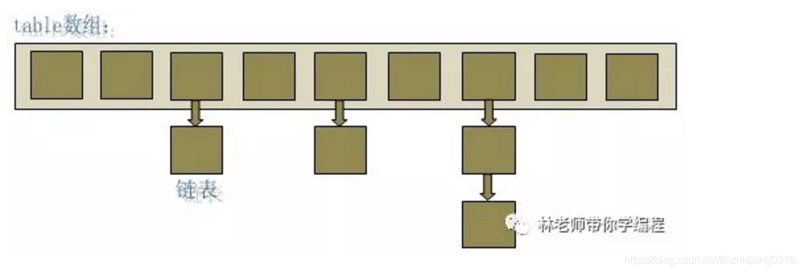

### 关于hashcode

1. hashCode的存在主要是用于查找的快捷性，如Hashtable，HashMap等，hashCode是用来在散列存储结构中确定对象的存储地址的

**再归纳一下就是hashCode是用于查找使用的，而equals是用于比较两个对象的是否相等的。**

### 关于equals

==用于比较引用类型和基本类型时具有不同的功能：

比较基本类型，如果两个值相同，则结果为true

比较应用类型，如果两个引用指向内存中同一对象，结果为true


equls

equls方法可以覆盖。equals()：是超类Object中的方法。

用来检测两个对象是否相等，即两个对象的内容是否相等。

### HashMap

HashMap实际上是一个“链表散列”的数据结构，即数组和链表的结合体。



当新建一个HashMap的时候，就会初始化一个数组。

```
transient HashMap.Node<K, V>[] table;
```

每个 Map.Entry 其实就是一个key-value对，它持有一个指向下一个元素的引用，这就构成了链表。

### ConcurrentHashMap 线程安全的具体实现方式

**ConcurrentHashMap 类所采用的正是分段锁的思想，将 HashMap 进行切割，把 HashMap 中的哈希数组切分成小数组，每个小数组有 n 个 HashEntry 组成，其中小数组继承自`ReentrantLock（可重入锁）`，这个小数组名叫`Segment`**