李宏毅的课：

### gan的学习分为一下几个部分

1. 首先我看了最初提出gan的论文：Generative Adversarial Networks  [论文链接](https://link.zhihu.com/?target=https%3A//arxiv.org/abs/1406.2661)

2. 去看一些浏览量高的博客讲解，通过这些博客大致了解gan的原理和应用，以及写博客的人对gan的理解。

3. 去看大牛的视频课程，全方位的去了解gan的原理及流程。

   这里我看的是 李宏毅对抗生成网络(GAN)国语教程(2018)。李宏毅的课程在网上的评价比较高。看视频的过程中我做了相应的笔记。以及自己的理解。

4. 使用以下别人的网络。

### 看完博客自己的理解：

​	gan的原理其实很简单。gan定义了两个网络。这两个网络都是多层感知机（原论文说两个网络都是多层感知机）。他们在互相对抗中一起成长。
​	这里的D网络就是一个回归问题。输入一个图片，D网络输出0-1之间的数字，数字越大说明输入越真实。
​	就好比印假钞的罪犯（生成器）和抓罪犯的警察（判断器）。罪犯制造的假钞技术越高，就越能骗过警察。警察的识别技术越高就越能抓住小偷（一篇论文里面的比喻）。
​	其实也可以理解成互助关系：比如学生（生成器）和老师（判别器），老师指出学生的不足，帮助学生改正。学生做出更加好的成绩。直到老师不能帮助学生改正。
​	具体的训练过程在后面的视频笔记里面介绍。

## 下面是李宏毅视频笔记

## Introduction

GAN的基本原理其实非常简单，这里以生成图片为例进行说明。假设我们有两个网络，G（Generator）和D（Discriminator）。正如它的名字所暗示的那样，它们的功能分别是：

- G是一个生成图片的网络，它接收一个随机的噪声z，通过这个噪声生成图片，记做G(z)。
- D是一个判别网络，判别一张图片是不是“真实的”。它的输入参数是x（x是一个向量vector），x代表一张图片，输出D（x）代表x为真实图片的概率，如果为1，就代表100%是真实的图片，而输出为0，就代表不可能是真实的图片。

## Generation：

### Image Generation

对于G网络。将一个随机生成的vector，把这个vector丢到generator里面。generator就要产生一张image。丢不同的vector到G网络里面，G网络就应该产生不同的image。

需要注意的是，他输入的是随机向量。他生成的图片是随机生成的。生成的而图片并没有什么太大的用处。比较有用的是Conditional Generation，就是你可以输入一些条件，比如说输入文字让机器产生对应的图片。

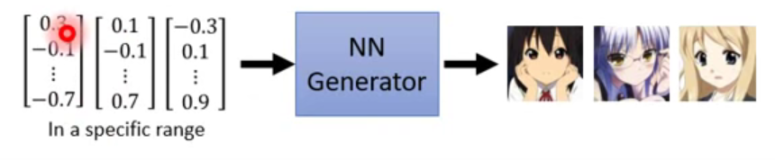

input  a specific range  -> output a image

### 随机向量和生成图片的关系

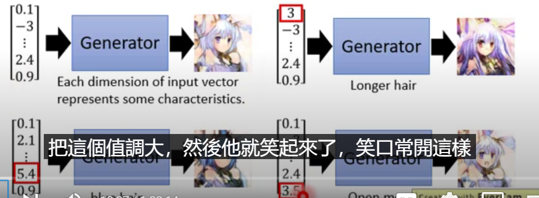

在G网络生成图片的过程中，我们可以控制生成照片的特征。比如向量的第一个值可以控制头发的颜色。当你改变第一个值的时候就可以改变头发的颜色。

### Disciminator

D网络输入一张图片当作input，输出是一个数值。代表输入图片的可信度，输出的值越大说明这张图片越真实。他相当于一个判别器，你输入一张图片，比如说输入的图片是generation的生成的图片。它会输出这个图片可信度。

### generation和disciminator的关系

这两个多层感知机会互相对抗。生成器会将生成的图片变得越来越真实。判别器会判别的越来越准确。

### 如何训练的

初始化参数。首先他两都是多层感知机，他们的初始参数都是随机生成的。

第一步：固定住生成器G的参数。更新判别器D的参数

首先使用生成器生成一些图片，这些图片都是假的，和真实的图片差距很大。我们需要一个Database。这个database里面的图片就是我们需要生成的图片。取出一些图片作为sample。这时将database取出的sample和G生成的图片最为数据集。去更新D的参数。这相当于是一个二分类问题。（这里可以做分类或者回归）

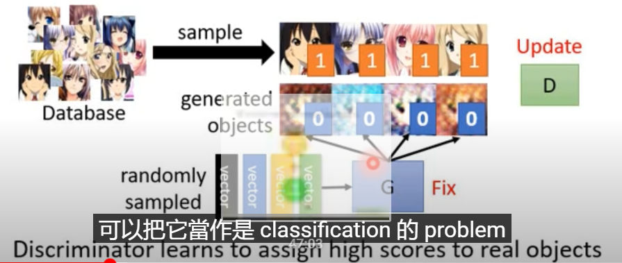

第二步：固定住D的参数。更新G的参数。

首先让G生成一张图片。然后将生成的图片丢进D里面去判别。判别出来的分数肯定是很差的。所以我们需要更新G的参数来是的D输出的分数更高一些。

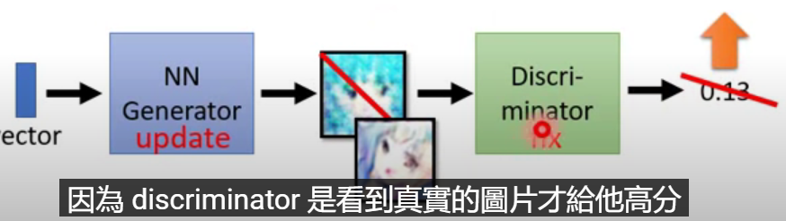

两个网络的参数怎么去更新呢。其实是这样的。我们将D和G两个网络合起来当作一个网络。这个大的网络输入一个vector输出一个置信度。

训练这个大的网络的时候，将D网络的所有隐藏层的参数固定，只调节G网络的隐藏层的参数。
我们的目标就是让这个大网络的输出越大越好。

### 整个算法

一个训练迭代的过程。

#### 第一部分

1. 我们需要一个database，这个database里面有真实的图片。（我们训练网络G，使得G可以生成出和这个database里面图片类似的图片）从里面取样batchsize个样本出来。可以是32张图片，也可以是64张图片。
2. 从一个分布中取样一个向量。比如说从高斯分布中取样m个vector。这个vector是有维度的，比如说5维、10维，这是一个参数需要自己调节。
3. 使用G网络，将这m个vector输入到G网络里面，产生m张图片。
4. 然后使用这些生成的图片和真实的图片来训练D网络。调整他的参数。（这里的函数使用的原始论文的函数）
   1. 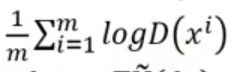
      将真实图片输入，我们将database里面的取样m张图片输入这个式子里面，D（xi)就是使用D网络判断一张图片的真实性得分。然后将结果取log。最后将m张图片的结果取平均值。所以这个式子的结果越大越好。
   2. 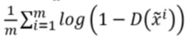
      将G网络生成的图片输入到这个式子里面。图片经过D网络输出一个置信度。由于这个图片是生成的。所以这个输出的置信度应该是很低的值。使用1减去这个值然后去对数，在将m张图片取平均值。所以整个式子的值应该越大越好。
   3. 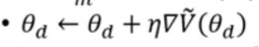
      这里是更新参数的公式，使用梯度下降算法应该减去（学习率 * 梯度)，这里需要将输出变为最大，所以需要加上梯度。

#### 第二部分：

1. 训练完D网络之后呢我们需要去训练G网络。我们选出m个照片，这m个照片可以和训练D网络的照片不同。训练的式子如下
   1. 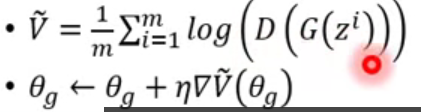
      看起来很复杂，其实就是使用G网络根据vector生成一个图片，然后用D网络去判别他的置信度取log，然后将m张图片的结果取个平均值。输出来的值越大越好。

然后循环往复两个步骤。

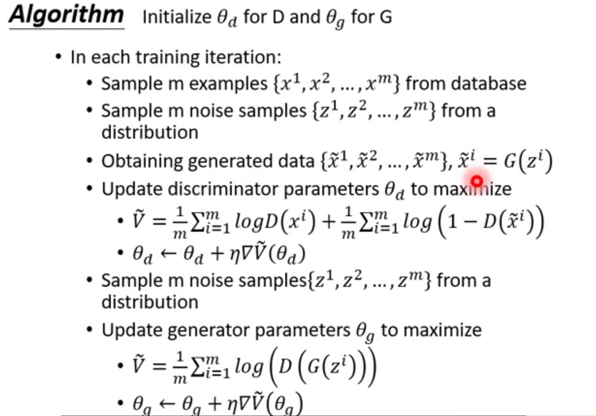

### Struceure Learning

我们平时做的机器学习问题就是去找到一个函数。输入X ，输出Y

Regression：output a scalar
Classification：output a "class" （one-hot vector）

Structured Learning: output a 

sequence, matrix, a graph, tree......

比如说以下问题都是structured learning 问题：

- 翻译，输入中文输出英文。
- 语音识别，输入语音输出文字Chat-bot，聊天机器人
  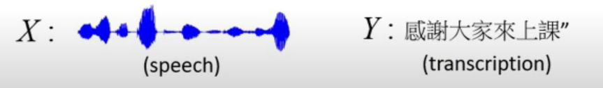
- 风格迁移，输入图片输出图片，比如将白天的照片变成晚上的照片
  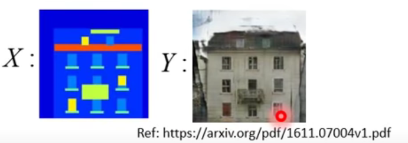
- 文字转图片，输入文字输出图片
  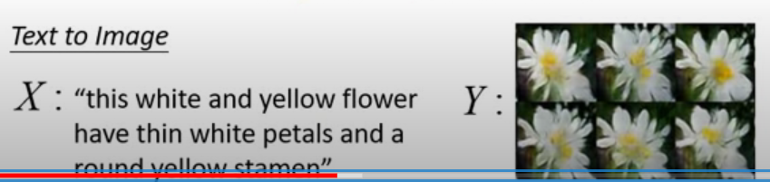

Generator：Learn to generate the object at the component level
Discriminator：Evaluatiing the whole object and find the best one

我的理解：

- 生成器是从各个组件之间的关系去学习如何生成图片，生成图片的时候是一个像素一个像素的去生成。他生成像素的时候某一个点的位置它并没有什么实际的意义，他的实际意义是靠像素之间的关系产生的。就像一句诗：这个婆娘不是人，九天仙女下凡尘。单看第一句是贬义，两句诗结合起来看就是褒义。
- 辨别器是从整个图片去判断他是真实的照片还是虚假的照片。

### Generator可以自己去训练网络吗

可以，生成器需要随机向量输入，然后输出图片。我们只需要找到对应的向量和图片让网络自己去学习即可。生成器会自己调优参数来根据向量来生成图片。

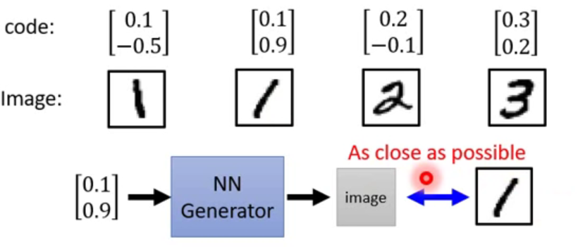

使用VAE来将图片变成向量，再将向量变成图片

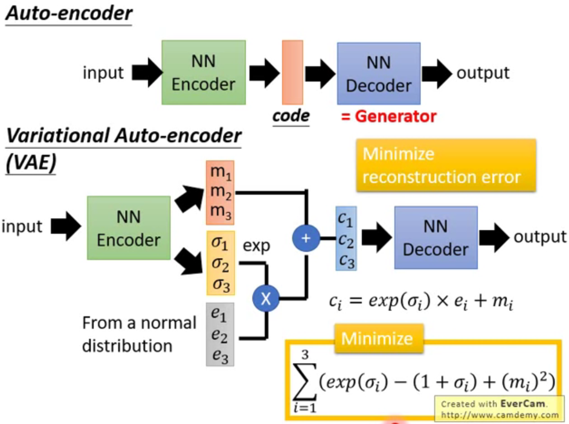

