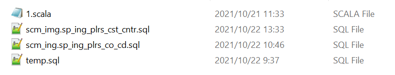
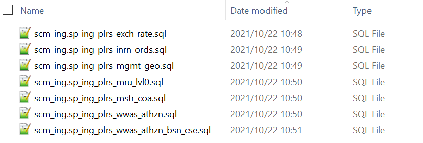

## 工作总结：

将scala代码转换成sql代码。

其中要注意的是文件名和表名的检查确认。






转换代码中遇到的一点问题：

### 问题一：

scala代码里面的list包含下面的两个字符转：这里有两种不同的0，上面的0是一个字符串类型，下面的0应该是int类型。

```
"'0' as inrn_ord_atr_10_tx"
"0 as recrd_clsfn_nr"
```

如果要把这两句转成sql的存储过程。是转成这个样子吗？

```
'0' as [inrn_ord_atr_10_tx],
'0' as [recrd_clsfn_nr],
```

#### 解决方案：

全部将0作为字符串处理，也就是处理成上面代码的样子。

### 问题二：主要是我不知道在哪去查文档

在select语句中会调用很多的函数，需要把scala代码中的函数转换成sql文件的函数。


