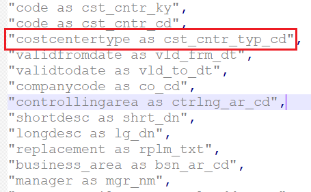
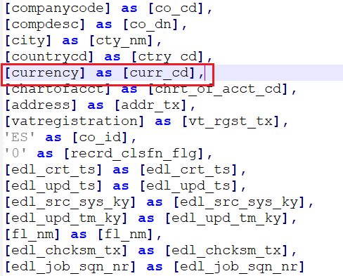
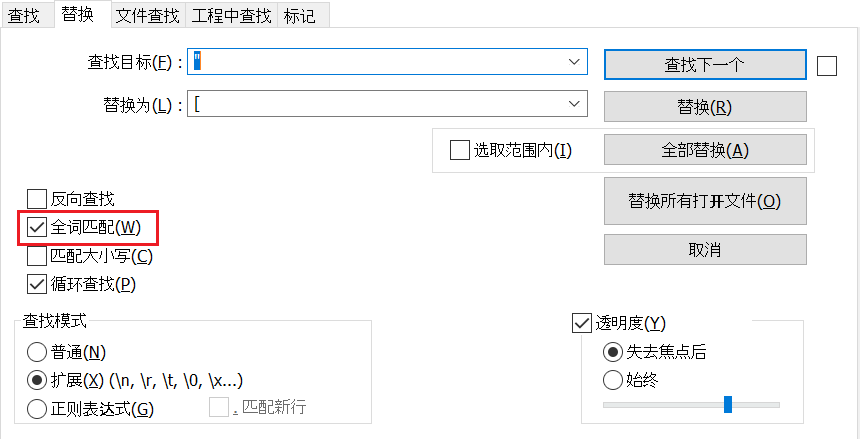
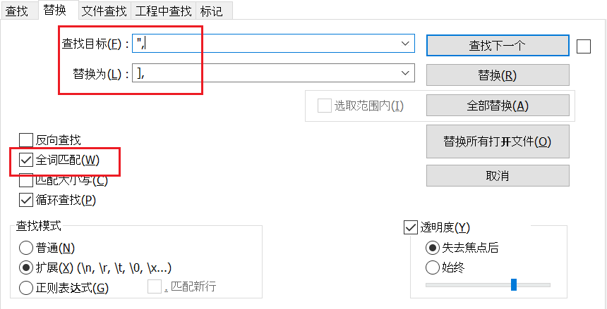
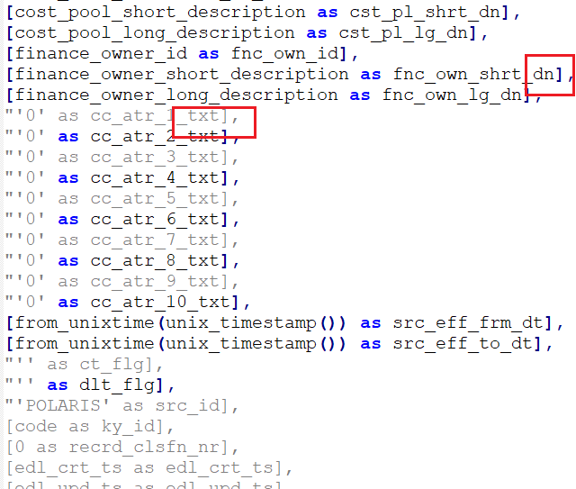
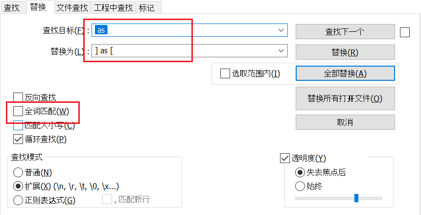
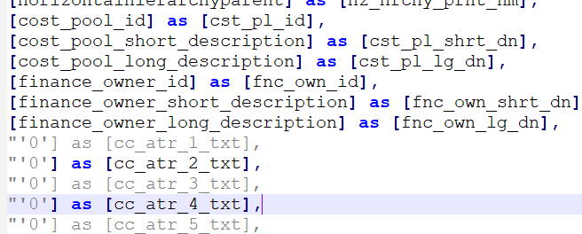

| case序号 | table name                  | 状态            | 注释                                                         | assign   |
| -------- | --------------------------- | --------------- | ------------------------------------------------------------ | -------- |
| 1        | ing_plrs_blk                | ok              | 复杂转换的例子                                               | lixiang* |
| 2        | ing_plrs_bsn_ar_hrchy       | ok              | 发给我一起打包了,已使用自定义函数写好11/4                    | xiewang* |
| 3        | ing_plrs_co_cd              | ok              | 已使用自定义函数写好11/4                                     | roc      |
| 4        | ing_plrs_cst_cntr           | ok              | from_unixtime(unix_timestamp()) - > current_timestamp        | roc      |
| 5        | ing_plrs_ctry_hrchy         | ok10/31         | 已使用自定义函数写好11/4                                     | roc*     |
| 6        | ing_plrs_exch_rate          | review,ok       | will check on 10/25 ，<br />to_date -> convert(datetime2(0), po_document_date) as [po_dcmt_dt]，还有几个函数没有转换过来 | roc      |
| 7        | ing_plrs_fnctl_ar_hrchy     | ok11/1          | 还有几个函数没翻译过来，已使用自定义函数写好11/4,可以执行    | roc*     |
| 8        | ing_plrs_gl_accts           | ok              | 发给我一起打包了,已使用自定义函数写好11/4                    | xiewang* |
| 9        | ing_plrs_inrn_ords          | ok              |                                                              | roc      |
| 10       | ing_plrs_mgmt_geo           | **review**， ok | if 参考 case when的写法，已完成。                            | roc      |
| 11       | ing_plrs_mru_hrchy          | ok              | 已使用自定义函数写好11/4,修改好了，待执行                    | roc*     |
| 12       | ing_plrs_mru_lvl0           | ok              |                                                              | roc      |
| 13       | ing_plrs_mstr_coa           | ok              |                                                              | roc      |
| 14       | ing_plrs_pft_cntr_hrchy     | ok              | 一些语句逻辑还需要改正10/28, 已使用自定义函数写好11/4，已修改，待执行 | roc*     |
| 15       | ing_plrs_wwas_athzn         | **review**，ok  | if 参考 case when的写法，以改完<br />10/26 多层if case 嵌套需要confirm | roc      |
| 16       | ing_plrs_wwas_athzn_bsn_cse | **review**，ok  | if 参考 case when的写法，以改完                              | roc      |

  问题记录：

- ing_plrs_pft_cntr_hrchy 分割的索引是从0开始，其他的都是从1开始


ing_plrs_mgmt_geo 改写if语句

```
if(geohierlvlcd='00',worldwidecd,subregion3cd) as subrgn_3_cd

case when geohierlvlcd='00' then worldwidecd else subregion3cd
end as [subrgn_3_cd]
```


sp_ing_plrs_wwas_athzn 改写

```
[if(action_code='A','Add',if(action_code='C','Change',if(action_code='D','Deactivated','0')))] as [acn_cd_dn]

case when action_code='A' then 'Add' when action_code='C' then 'Change' when action_code='D' then 'Deactivated' else '0' end as [acn_cd_dn]
```


sp_ing_plrs_exch_rate改写

```
ADD_MONTHS(convert(datetime2(0), CONCAT(effectivedate,'01')),01)

DATEADD(month, 01, CONVERT(VARCHAR(10),CONCAT(effectivedate,'01'), 12))
```

```
cast(accountingrate as decimal(20,4))*0.0001 as acctng_rate

CONVERT(DECIMAL(20,4), accountingrate)*0.0001
```


总结：

| 序号 | scala代码                                                    | sql代码                                                      |
| ---- | ------------------------------------------------------------ | ------------------------------------------------------------ |
| 1    | to_date(po_document_date, 'yyyyMMdd')                        | convert(datetime2(0), po_document_date)                      |
| 2    | from_unixtime(unix_timestamp())                              | current_timestamp                                            |
| 3    | if(split(ariba_id, '-')[1] is null, ariba_id,split(ariba_id, '-')[0]) as pr_nr | case when ariba_id like '%-%' then SUBSTRING(ariba_id, 0, charindex('-',ariba_id))<br/>	 else ariba_id<br/>end as [pr_nr] |
| 4    | ADD_MONTHS(to_date(CONCAT(effectivedate,'01'),'yyMMdd'),01) as prr_to_dt | DATEADD(month, 01, CONVERT(VARCHAR(10),CONCAT(effectivedate,'01'), 12)) |
| 5    | cast                                                         |                                                              |
| 6    | ADD_MONTHS(convert(datetime2(0), CONCAT(effectivedate,'01')),01) | DATEADD(month, 01, CONVERT(VARCHAR(10),CONCAT(effectivedate,'01'), 12)) |
| 7    | cast(accountingrate as decimal(20,4))*0.0001 as acctng_rate  | CONVERT(DECIMAL(20,4), accountingrate)*0.0001                |
|      | lit(null)                                                    | null                                                         |
|      | split                                                        | split                                                        |
|      | coalesce                                                     | coalesce                                                     |
|      | .withColumn("L1", coalesce(col("PARENTLINEAGE_LIST")(1), lit("0"))) | coalesce(SUBSTRING_INDEX(SUBSTRING_INDEX(PARENTLINEAGE_LIST, ".", 1), ".", -1), "0") AS [L1], |
|      | cndList: _*                                                  | 表示使用列表的字段                                           |
|      | from_unixtime(unix_timestamp(lit("1899-01-01 00:00:00"), "yyyy-MM-dd hh:mm:ss")) | convert(datetime2(0), '1899-01-01 00:00:00', 20)             |

## spark function：

- split：Splits str around matches of the given pattern  [link](https://spark.apache.org/docs/3.2.0/api/scala/org/apache/spark/sql/functions$.html#split(str:org.apache.spark.sql.Column,pattern:String):org.apache.spark.sql.Column)

- withColumn:  Returns a new Dataset by adding a column or replacing the existing column that has the same name.  [link](https://spark.apache.org/docs/3.2.0/api/scala/org/apache/spark/sql/Dataset.html#withColumn(colName:String,col:org.apache.spark.sql.Column):org.apache.spark.sql.DataFrame)

  example:  [ref](https://sparkbyexamples.com/spark/spark-dataframe-withcolumn/)

  ```scala
  df.withColumn("Country", lit("USA"))  // to add a constant value to a DataFrame column
  ```

  ```scala
  df.withColumn("salary",col("salary")*100)  //to update the value of an existing column
  ```

- coalesce(e: [Column](https://spark.apache.org/docs/3.2.0/api/scala/org/apache/spark/sql/Column.html)*): [Column](https://spark.apache.org/docs/3.2.0/api/scala/org/apache/spark/sql/Column.html): Returns the first column that is not null, or null if all inputs are null. [Spark 3.2.0 ScalaDoc - org.apache.spark.sql.functions](https://spark.apache.org/docs/3.2.0/api/scala/org/apache/spark/sql/functions$.html#coalesce(e:org.apache.spark.sql.Column*):org.apache.spark.sql.Column)

- selectExpr: Selects a set of SQL expressions. This is a variant of `select` that accepts SQL expressions. [Spark 3.2.0 ScalaDoc - org.apache.spark.sql.Dataset](https://spark.apache.org/docs/3.2.0/api/scala/org/apache/spark/sql/Dataset.html#selectExpr(exprs:String*):org.apache.spark.sql.DataFrame)

- filter: Filters rows using the given SQL expression. [Spark 3.2.0 ScalaDoc - org.apache.spark.sql.Dataset](https://spark.apache.org/docs/3.2.0/api/scala/org/apache/spark/sql/Dataset.html#filter(conditionExpr:String):org.apache.spark.sql.Dataset[T])


## synapse function

- split : Splits a given string according to a given delimiter and returns a string array with the contained substrings.  [split() - Azure Data Explorer | Microsoft Docs](https://docs.microsoft.com/en-us/azure/data-explorer/kusto/query/splitfunction)


```sql
/* 当po_id列不包含'-'，就直接将po_id列选择出来，如果包含，就把到'-'前面的字符串取出来取出来
例子  'aaaa' return 'aaaa'
     'aa-aa' return 'aa'
*/
CASE WHEN CHARINDEX('-', po_id) < 1 THEN po_id ELSE SUBSTRING(po_id, 0, CHARINDEX('-', po_id)) END AS po_compare,
CASE WHEN CHARINDEX('-', po_id) < 1 THEN NULL ELSE SUBSTRING(po_id, CHARINDEX('-', po_id) + 1, LEN(po_id) - CHARINDEX('-', po_id)) END
```


## scala代码转换sql代码的流程：

```sql
SET ANSI_NULLS ON
GO
SET QUOTED_IDENTIFIER ON
GO
CREATE PROC [scm_ing].[sp_/*case名*/] AS
BEGIN
SET NOCOUNT ON;
WITH CTE AS
(
    SELECT 
        /*这里插入对应的select语句*/
     FROM 
    	/*这里需要查表对应*/
)
INSERT INTO [scm_ing].[/*case名*/]
SELECT * FROM CTE

END
GO
```


### 1.修改文件名：

scm_ing.sp_  加上case匹配的字符串

采用 schema.procname的方式命名，其中scm_ing应该是固定的。

### 2.修改存储过程名

CREATE PROC [scm_ing].[sp_ing_plrs_co_cd] AS      

这个名字就是文件名。

### 2.2 插入一个步骤 

将with as 关键字中间的名字修改为 CET即可，因为今天转换的scala代码没有使用UNINON连接表。

需要修改两处，还有一处是文件结尾的select语句。

### 3.修改from的表：从下面的对应表里面查找。

已知条件为ing开头的表。就是case匹配的字符串。from的表以imt开头。

imt开头的表是源表，从这个表里面查找， 放到ing开头的表里面
IMT_TABLE	ING_TBL
imt_polaris_blk	ing_plrs_blk
imt_polaris_busn_area_heir	ing_plrs_bsn_ar_hrchy
imt_polaris_cmpny_code	ing_plrs_co_cd
imt_polaris_cst_cntr	ing_plrs_cst_cntr
imt_polaris_cntry_heir	ing_plrs_ctry_hrchy
imt_polaris_exchng_rt	ing_plrs_exch_rate
imt_polaris_func_area_heir	ing_plrs_fnctl_ar_hrchy
imt_polaris_prft_loss	ing_plrs_gl_accts
imt_polaris_intrnl_ords	ing_plrs_inrn_ords
imt_polaris_mgmt_geo	ing_plrs_mgmt_geo
imt_polaris_mru_heir	ing_plrs_mru_hrchy
imt_polaris_mru_lvl0	ing_plrs_mru_lvl0
imt_polaris_mstr_coa	ing_plrs_mstr_coa
imt_polaris_prft_cnter_heir	ing_plrs_pft_cntr_hrchy
imt_polaris_wwas_auth	ing_plrs_wwas_athzn
imt_polaris_wwas_auth_bus_case	ing_plrs_wwas_athzn_bsn_cse

### 4.修改插入的表名

INSERT INTO [scm_ing].[ing_plrs_co_cd]

这里需要将INTO后面的表名修改，修改后的表名就是case匹配的字符串。

### 5.改写 select选择的列

对应case的colExpr列表。将列表里面的sql表达式转换成对应的sql语句。如下所示。需要注意的是要将一些函数对应的替换。

#### 第一步：

由于scala代码的sql语句是使用字符串表示。还在一行显示，所以需要将代码分行。

操作：使用查找替换将 ", 替换成  ",\r\n 即可完成换行操作。

```
"code as cst_cntr_ky", "code as cst_cntr_cd",
```

#### 第二步：

目标：替换符号：



将引号内的字符串变成sql代码的格式。下面是目标格式实例。



1.替换每一行的首个"号，注意全词匹配。它会匹配一行的第一"而不会匹配末尾的 ", 因为行尾的引号和逗号连在一起，不会全词匹配上。



修改完之后是这个样子：注意到这两个地方，硬编码的代码引号和逗号连着，所以它会和行尾的情况类似，不会被替换，还有一个就是语句结束的地方由于没有逗号所以也会被替换。这里需要手动修改即可。


2.将行尾的引号变成]



替换完之后的效果图：可以看到行尾的替换是很完整的，没有特例。



3.还有就是中间的as部分。这里不能选择全词匹配，因为他在中间。



替换完之后的效果图：替换的还是很完整的。现在剩下的就是对于一些特例的手动修改。



目前还存在的问题，scala代码的函数和sql函数需要对应，还没查出来。


问题一：

scala代码里面的list包含下面的两个字符转：这里有两种不同的0，上面的0是一个字符串类型，下面的0应该是int类型。

```
"'0' as inrn_ord_atr_10_tx"
"0 as recrd_clsfn_nr"
```

如果要把这两句转成sql的存储过程。是转成这个样子吗？

```
'0' as [inrn_ord_atr_10_tx],
'0' as [recrd_clsfn_nr],
```

