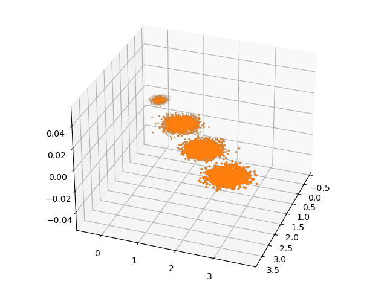
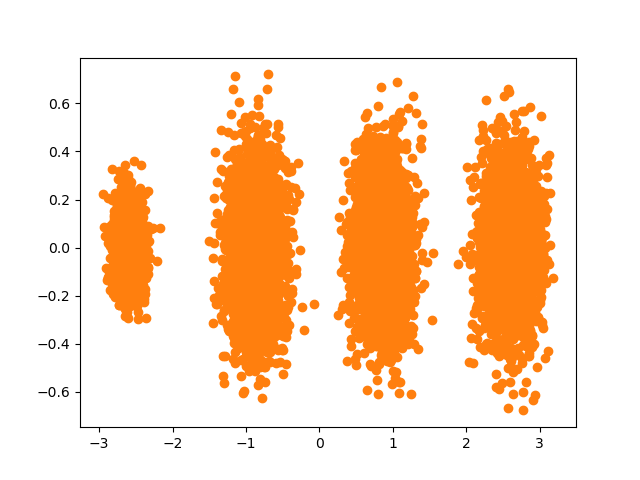

自己生成数据，然后画图。看博客完成，但是参考博客使用的是python2写的，例子有点老。

```python
import matplotlib.pyplot as plt
import sklearn.decomposition as dp
import numpy as np
from mpl_toolkits.mplot3d import Axes3D
from sklearn.datasets._samples_generator import make_blobs

X, y = make_blobs(n_samples=10000, n_features=3, centers=[[3, 3, 3], [0, 0, 0], [1, 1, 1], [2, 2, 2]],
                  cluster_std=[0.2, 0.1, 0.2, 0.2], random_state=9)
print(X.shape)
fig = plt.figure()
ax = Axes3D(fig, rect=[0, 0, 1, 1], elev=30, azim=20)
plt.scatter(X[:, 0], X[:, 1], X[:, 2], marker='o')
plt.show()

pca = dp.PCA(n_components=3)
pca.fit(X)
print(pca.explained_variance_ratio_)
# [0.98318212 0.00850037 0.00831751]
# 可以看出投影后三个特征维度的方差比例大约为98.3%：0.8%：0.8%。投影后第一个特征占了绝大多数的主成分比例。
print(pca.explained_variance_)
# [3.78521638 0.03272613 0.03202212]

pca = dp.PCA(n_components=2)
pca.fit(X)
print(pca.explained_variance_ratio_)
# [0.98318212 0.00850037]
# 和上面对比可以看出方差小的纬度被删除了， 投影到二维后选择的肯定是前两个特征，而抛弃第三个特征。

X_new = pca.transform(X)
plt.scatter(X_new[:, 0], X_new[:, 1], marker='o')
plt.show()
```

三维图，生成数据就是三维的，直接显示。



二维图，只保留了两个维度



老师给的数据：

参考：https://matplotlib.org/2.2.2/gallery/mplot3d/scatter3d.html?highlight=axes3d

```python
import numpy as np
import scipy.io as scio
from sklearn import preprocessing
import sklearn.decomposition as dp
import matplotlib.pyplot as plt
from mpl_toolkits.mplot3d import Axes3D

# 1.读取数据
X = scio.loadmat("/Volumes/roczhang/download/data/112/T32data.mat")['testData']
y = scio.loadmat("/Volumes/roczhang/download/data/112/T32testlabel.mat")['testlabel']
print(X.shape)
print(y.shape)

# 2.归一化 将每一列的特征归一化
X_norm = preprocessing.normalize(X, norm='l2', axis=0)  # axis=0 竖着规范每个特征

# 3.主成分分析，选取三个主成分
pca = dp.PCA(n_components=3)
pca.fit(X_norm)
# print(pca.explained_variance_ratio_)
X_new = pca.transform(X_norm)

# 4.合并两个数组 使用不同的颜色和形状来显示不同类型的数据。
Xy = np.concatenate((X_new, y), axis=1)
print(len(Xy))
print(Xy[4][3])

# 5.定义两个数组，分别用来存储0，1类别的数据
zero = []
one = []
other = []
print(range(len(Xy)))

# 6.将数据分装
for i in range(len(Xy)):
    if (Xy[i][3] == 0):
        zero.append(Xy[i])
    elif(Xy[i][3] == 1):
        one.append(Xy[i])
    else:
        print("第i行的标签不是0或1：", i)

# 7.将分装的数据转换成numpy格式
one_norm = np.array(one)
print(one_norm.shape)

zero_norm = np.array(zero)
print(zero_norm.shape)

# 8.画图
fig = plt.figure()
ax = fig.add_subplot(111, projection='3d')
# 将类别为1的数据画到figure上面
ax.scatter(one_norm[:, 0], one_norm[:, 1], one_norm[:, 2], c='r', marker='o')
# 将类别为0的数据画到figure上面
ax.scatter(zero_norm[:, 0], zero_norm[:, 1], zero_norm[:, 2], c='b', marker='^')

# 9.设置xyz轴
ax.set_xlabel('X Label')
ax.set_ylabel('Y Label')
ax.set_zlabel('Z Label')
# 10.显示图像
plt.show()
```